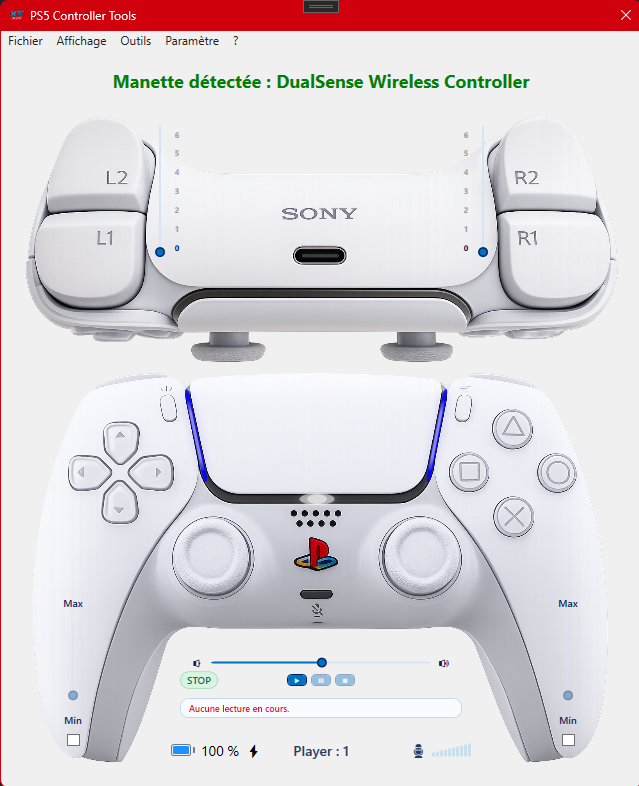

# 🎮 PS5 Controller Tools

Outil de test et de diagnostic pour manette PS5 après réparation.

---

## 🚀 Fonctionnalités

- 🔊 Test du haut-parleur (lecture audio + visualisation)
- 🎙 Gestion du micro
- 🎮 Lecture des entrées (joysticks, gâchettes, boutons)
- 💡 Gestion des LEDs (couleurs personnalisées)
- 🎚️ Test des vibrations
- 🖐️ Suivi du pavé tactile
- ⚙️ Outils de diagnostic en temps réel

---

## 🖥️ Aperçu



---

## 🛠️ Technologies utilisées

- C#
- WPF (.NET)
- SDL2
- WebHID (selon mode utilisé)

---

## 📦 Installation

1. Cloner le projet :
```bash
git clone https://github.com/CGD-KB13/PS5-Controller-Tools.git